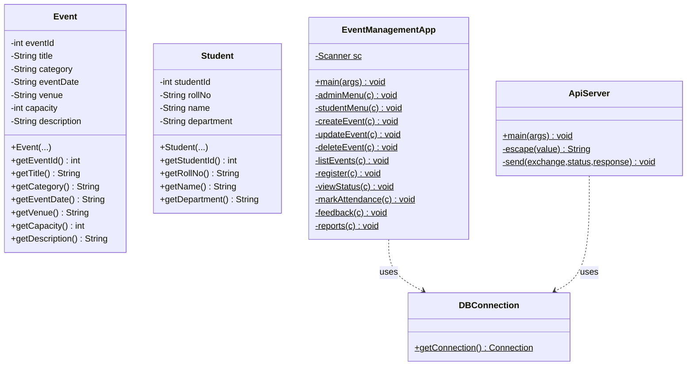

```mermaid
classDiagram

    class Event {
        -int eventId
        -String title
        -String category
        -String eventDate
        -String venue
        -int capacity
        -String description
        +Event(...)
        +getEventId() int
        +getTitle() String
        +getCategory() String
        +getEventDate() String
        +getVenue() String
        +getCapacity() int
        +getDescription() String
    }

    class Student {
        -int studentId
        -String rollNo
        -String name
        -String department
        +Student(...)
        +getStudentId() int
        +getRollNo() String
        +getName() String
        +getDepartment() String
    }

    class DBConnection {
        +getConnection() Connection$
    }

    class EventManagementApp {
        -Scanner sc$
        +main(args) void$
        -adminMenu(c) void$
        -studentMenu(c) void$
        -createEvent(c) void$
        -updateEvent(c) void$
        -deleteEvent(c) void$
        -listEvents(c) void$
        -register(c) void$
        -viewStatus(c) void$
        -markAttendance(c) void$
        -feedback(c) void$
        -reports(c) void$
    }

    class ApiServer {
        +main(args) void$
        -escape(value) String$
        -send(exchange,status,response) void$
    }

    EventManagementApp ..> DBConnection : uses
    ApiServer ..> DBConnection : uses
```
