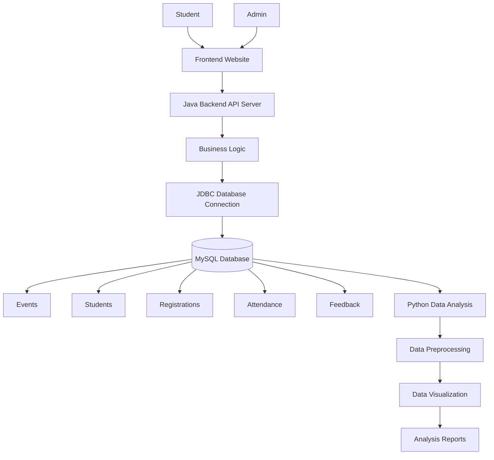

# System Architecture

```mermaid
flowchart TD
    A[Student] --> B[Frontend Website]
    C[Admin] --> B

    B --> D[Java Backend API Server]

    D --> E[Business Logic]
    E --> F[JDBC Database Connection]
    F --> G[(MySQL Database)]

    G --> H[Events]
    G --> I[Students]
    G --> J[Registrations]
    G --> K[Attendance]
    G --> L[Feedback]

    G --> M[Python Data Analysis]
    M --> N[Data Preprocessing]
    N --> O[Data Visualization]
    O --> P[Analysis Reports]
```
